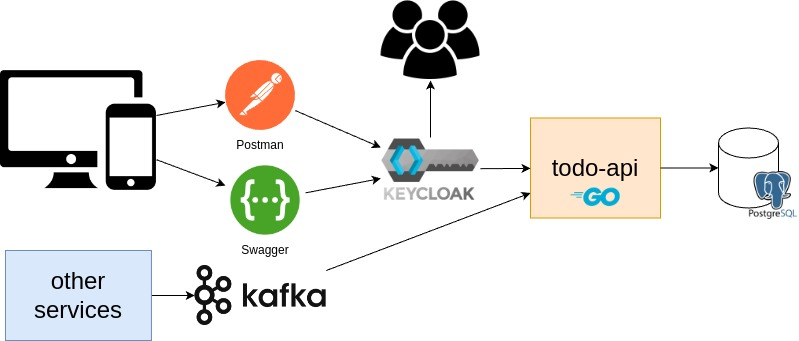

# ToDo List API em Go

Este projeto é uma aplicação simples de lista de tarefas (ToDo List), implementada usando Go (Golang) com o framework Gin-Gonic. A API permite aos usuários criar, visualizar, atualizar e deletar tarefas. Inclui autenticação JWT para segurança e utiliza PostgreSQL como banco de dados. A documentação da API é feita com Swagger, oferecendo uma interface amigável para interação com a API.

## Diagrama



## Funcionalidades

- CRUD de tarefas:
  - Criar tarefas
  - Ler tarefas
  - Atualizar tarefas
  - Deletar tarefas
  - Criar tarefa a partir do kafka

## Tecnologias Utilizadas

- **[Go](https://golang.org/)**: Linguagem de programação usada.
- **[Gin-Gonic](https://github.com/gin-gonic/gin)**: Framework web utilizado para criar a API.
- **[PostgreSQL](https://www.postgresql.org/)**: Banco de dados.
- **[JWT-go](https://github.com/golang-jwt/jwt)**: Biblioteca para implementar autenticação JWT.
- **[Swag](https://github.com/swaggo/swag)**: Ferramenta para gerar a documentação da API com Swagger.
- **[Kafka](https://github.com/confluentinc/confluent-kafka-go)**: Ferramenta de mensageria.

## Pré-requisitos

Antes de iniciar, você precisará ter instalado em sua máquina:
- Go (1.21.1 ou superior)
- PostgreSQL
- Git (opcional, para clonar o repositório)
- Zookeeper
- Kafka

## Configuração do Banco de Dados

1. Instale e configure o PostgreSQL em seu ambiente.
2. Crie um banco de dados chamado `todo_list`.
3. Configure as credenciais de acesso ao PostgreSQL no arquivo de configuração da aplicação.
    Exemplo:
    ```
    DB_HOST=localhost
    DB_PORT=5432
    DB_USER=user
    DB_PASSWORD=123
    DB_NAME=aula
    ```

## Instalação

Clone o projeto (ou baixe o zip):

```bash
git clone https://github.com/gsantosc18/todo.git
cd todo
```

Instale as dependências do projeto:

```bash
go mod tidy
```

## Executando a aplicação

Para iniciar o servidor, execute:

```bash
go run main.go
```

O servidor estará disponível em `http://localhost:8080`.

## Uso da API

Você pode acessar a documentação da API e testar os endpoints através do Swagger UI em `http://localhost:8080/swagger/index.html`.

### Exemplos de Requests

**Criar uma nova tarefa**

```bash
curl -X POST http://localhost:8080/todo
-H 'Content-Type: application/json' 
-H 'Authorization: Bearer [TOKEN]'
-d '{"title": "Nova Tarefa", "description": "Descrição da tarefa"}'
```

**Obter todas as tarefas**

```bash
curl -X GET http://localhost:8080/todo
```
